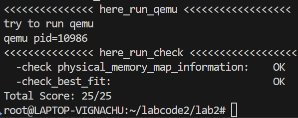
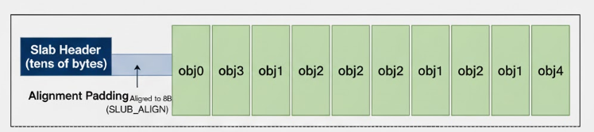

# 练习1：理解first-fit 连续物理内存分配算法

## first-fit核心思想
First-fit 核心思想是按顺序查找空闲分区链表，将第一个大小满足需求的空闲块分配给进程，如果这个空闲块大小正好，那么就直接分配给进程，如果这个空闲块大了，就把大的那部分切分，重新作为空闲块，如果能与相邻空闲块合并，则合并为更大的空闲块。

## 核心数据结构
FFMA的实现主要依赖于以下数据结构：
- `struct Page`：代表物理页框，包含多个成员：
  - `page_link`：将空闲块的起始页链接到空闲列表；
  - `property`：仅在空闲块的起始页上有效，记录了该连续空闲块包含的页数$N$；
  - `flags`：用于标记该页是否为空闲块的起始页。
- `free_list`：全局双向链表头，用于按物理地址顺序管理所有连续的空闲内存块；
- `nr_free`：记录当前系统中所有空闲页框的总数。

## 物理内存分配过程
**整个物理内存分配过程由以下四个核心函数协同完成：**
1. `default_init`：
- **代码如下**：
```C
static void default_init(void) {
    list_init(&free_list);
    nr_free = 0;
}
```
- **代码分析**：
  - 这段代码首先将空闲链表清空，然后把空闲页数目归0，但目前还没有与物理内存联系。
2. `default_init_memmap`：
- **代码如下**：
```C
default_init_memmap(struct Page *base, size_t n) {
    assert(n > 0);
    struct Page *p = base;
    for (; p != base + n; p ++) {
        assert(PageReserved(p));
        p->flags = p->property = 0;
        set_page_ref(p, 0);
    }
    base->property = n;
    SetPageProperty(base);
    nr_free += n;
    if (list_empty(&free_list)) {
        list_add(&free_list, &(base->page_link));
    } else {
        list_entry_t* le = &free_list;
        while ((le = list_next(le)) != &free_list) {
            struct Page* page = le2page(le, page_link);
            if (base < page) {
                list_add_before(le, &(base->page_link));
                break;
            } else if (list_next(le) == &free_list) {
                list_add(le, &(base->page_link));
            }
        }
    }
}
```
- **代码分析**：
  - 这段代码首先判断页表项大于0，然后指向块首指针，接着把循环把每个指针的flags/property/ref 归零，允许对每项进行分配、释放等操作，然后把块首的property标为n，证明有n个连续页空闲，并标明我是空闲页块首，还把空闲页数量加n。（flags 标识页框的状态（是否保留、是否为空闲块起始页等），property 仅在空闲块起始页中记录 “连续空闲页数量”，ref 标明页框的 “被引用次数”。）
  - 后面的if分支是将新的空闲块（以base为起始页）插入到空闲链表free_list中，并保持链表按页框的物理地址从小到大有序排列，具体的判断逻辑如下：
    - 先判断空闲链表free_list是否为空：
    - 若为空，直接将新空闲块的起始页base的链表节点（base->page_link）加入链表。
    - 若链表非空，则遍历链表查找插入位置：
    - 遍历过程中，通过le2page将链表节点转换为对应的页框page，比较base与page的物理地址（base < page表示base的地址更小）。
      - 找到第一个地址大于base的页框节点时，将base的节点插入到该节点前面（list_add_before），保证链表按地址递增排序。
      - 若遍历到链表末尾仍未找到更大的节点，则将base的节点插入到链表末尾（list_add）。
      - （`le2page` 是一个宏，用于将 “链表节点指针” 转换为 “包含该节点的页框（struct Page）指针”，具体功能是已知某个 list_entry_t 类型的链表节点（le）的地址，计算出包含该节点的 struct Page 结构体的起始地址。）
3. `default_alloc_pages`：
- **代码如下**：
```C
default_alloc_pages(size_t n) {
    assert(n > 0);
    if (n > nr_free) {
        return NULL;
    }
    struct Page *page = NULL;
    list_entry_t *le = &free_list;
    while ((le = list_next(le)) != &free_list) {
        struct Page *p = le2page(le, page_link);
        if (p->property >= n) {
            page = p;
            break;
        }
    }
    if (page != NULL) {
        list_entry_t* prev = list_prev(&(page->page_link));
        list_del(&(page->page_link));
        if (page->property > n) {
            struct Page *p = page + n;
            p->property = page->property - n;
            SetPageProperty(p);
            list_add(prev, &(p->page_link));
        }
        nr_free -= n;
        ClearPageProperty(page);
    }
    return page;
}
```
- **代码分析**：
  - 首先判断要分配的页大于0，然后判断需要分配的页数是不是大于空闲的页数，如果满足那么返回空。
  - 然后就是找到第一个满足分配要求的块了，具体步骤如下：
    - 首先初始化遍历变量：page 用于存储找到的空闲块起始页（初始为 NULL，表示未找到）；le 是链表遍历指针，从空闲链表头 free_list 开始。
    - 遍历空闲链表：while 循环通过 list_next(le) 依次获取下一个链表节点，直到 le 回到链表头（表示遍历完所有空闲块）。
    - 链表节点转页框：通过 le2page(le, page_link) 将链表节点 le 转换为对应的页框指针 p（因为 struct Page 包含 page_link 成员）。
    - 判断空闲块大小：检查当前页框 p 的 property（空闲块大小，单位是页）是否 ≥ n。若满足，说明找到首个足够大的空闲块，将 page 指向 p 并跳出循环。
  - 找到空闲块后，接着就是处理没用到的空闲块，具体步骤如下：
    - 从空闲链表中删除已分配的空闲块：首先获取 page 在链表中的前一个节点（用于后续插入剩余块时保持链表有序），接着将 page 的链表节点从 free_list 中删除（避免后续分配时重复处理该块）。
    - 分割剩余空间（若空闲块有多余）：首先判断如果空闲块大小（page->property）大于需要分配的 n 页，说明分配后有剩余空间，需将剩余部分作为新空闲块重新加入链表，接着计算剩余空间的起始页（page 是分配块的起始页，跳过 n 个页后就是剩余块的起点），然后设置剩余块的大小（原块总大小减去分配的 n 页），然后给剩余块的起始页 p 设置 PG_property 标志（标记它是新空闲块的起始页），最后将剩余块的链表节点插入到 prev 后面。
  - 最后更新系统状态：
    - 首先将系统总空闲页数减去分配的 n 页，确保 nr_free 始终反映真实空闲量;
    - 然后清除 page 的 PG_property 标志（page 已被分配，不再是空闲块）。
4. `default_free_pages`:
- **代码如下**
```C
default_free_pages(struct Page *base, size_t n) {
    assert(n > 0);
    struct Page *p = base;
    for (; p != base + n; p ++) {
        assert(!PageReserved(p) && !PageProperty(p));
        p->flags = 0;
        set_page_ref(p, 0);
    }
    base->property = n;
    SetPageProperty(base);
    nr_free += n;

    if (list_empty(&free_list)) {
        list_add(&free_list, &(base->page_link));
    } else {
        list_entry_t* le = &free_list;
        while ((le = list_next(le)) != &free_list) {
            struct Page* page = le2page(le, page_link);
            if (base < page) {
                list_add_before(le, &(base->page_link));
                break;
            } else if (list_next(le) == &free_list) {
                list_add(le, &(base->page_link));
            }
        }
    }

    list_entry_t* le = list_prev(&(base->page_link));
    if (le != &free_list) {
        p = le2page(le, page_link);
        if (p + p->property == base) {
            p->property += base->property;
            ClearPageProperty(base);
            list_del(&(base->page_link));
            base = p;
        }
    }

    le = list_next(&(base->page_link));
    if (le != &free_list) {
        p = le2page(le, page_link);
        if (base + base->property == p) {
            base->property += p->property;
            ClearPageProperty(p);
            list_del(&(p->page_link));
        }
    }
}
```
- **代码分析**：
  - 这段代码的功能是释放连续物理页并合并相邻空闲块，首先确保释放的页数不为 0。
  - 然后遍历从 base 到 base + n 的每个页框，先通过 assert 校验：这些页框不是保留页（!PageReserved(p)，避免释放内核关键内存）且不是空闲块起始页（!PageProperty(p)，避免重复释放空闲页）。接着清除所有状态标志，并将引用计数设为 0（表示已无任何进程使用），确保后续可被重新分配。
  - 接着将释放块的起始页 base 的 property 设为 n（表示该空闲块包含 n 个连续页），并给 base 设置 PG_property 标志（标记它是空闲块的起始页），然后将系统总空闲页数加上释放的 n 页，确保 nr_free 反映真实空闲量。
  - 然后将空闲块插入到链表中，判断方法和上面类似，这里不再解释。
  - 最后与前面不同的是，这步释放的空闲块可以与相邻的空闲块合并，首先获取 base 在链表中的前一个节点 le，若 le 不是链表头（即存在前序节点），通过 le2page 转换为页框 p。然后判断 p 的空闲块结束地址（p + p->property）是否等于 base 的起始地址，如果相等说明两者连续，可合并。接着更新前序块的总大小，然后清除 base 的空闲起始标志（因为它已合并到 p），从链表中删除 base 的节点，最后更新 base 为 p。如果空闲块和后面的相邻，代码与之类似我不再赘述了。

## 程序在进行物理内存分配的过程以及各个函数的作用
**前面成果总结**：
1. 首先是物理内存分配过程：
   - 初始化阶段：系统启动时，初始化内存管理器的核心数据结构（空闲链表、空闲页计数），为后续管理做准备。
   - 内存映射阶段：将物理内存中可用的连续区域（非保留区域）初始化为 “空闲块”，加入空闲链表，使这些内存可被分配。
   - 分配阶段：当进程 / 内核需要内存时，从空闲链表中查找第一个足够大的空闲块，分割并分配所需页数，更新空闲链表和计数。
   - 释放阶段：当内存不再使用时，将其释放回空闲链表，并尝试与相邻空闲块合并（减少碎片），更新空闲链表和计数。
2. 函数作用：
   - `default_init()`：初始化内存管理器
   - `default_init_memmap(struct Page *base, size_t n)`：初始化空闲内存块
   - `default_alloc_pages(size_t n)`：分配连续物理页
   - `default_free_pages(struct Page *base, size_t n)`：释放连续物理页

## 算法的改进空间
**本实验中的First-Fit的算法还有很大的改进空间，具体如下表所示**
| 改进方向 | 改进策略 | 优点 | 缺点/适用性 |
| :--- | :--- | :--- | :--- |
| **分配策略** | **Best-Fit 算法** | 尽量分配大小最接近需求的空闲块，减少内部碎片。 | 需要遍历整个空闲列表，搜索时间增加；倾向于产生大量小的外部碎片。 |
| **分配策略** | **Next-Fit 算法** | 从上次分配结束的位置开始搜索，而非总是从列表头开始。 | 搜索分布更均匀，可能略微提高搜索效率，但碎片问题未根本解决。 |
| **数据结构** | **分离空闲列表 (Segregated Lists)** | 为不同大小的空闲块维护独立的链表，加速查找。 | 复杂度增加，实现更复杂。 |
| **碎片管理** | **伙伴系统 (Buddy System)** | 强制空闲块大小为 $2^k$，利用伙伴块机制高效合并和分裂内存。 | 分配和释放的时间复杂度为 $O(\log N)$；可能引入**内部碎片**（由于大小必须向上取整）。 |

# 练习2： 实现 Best-Fit 连续物理内存分配算法

## 算法原理
1. **分配原则**:Best-Fit通过**遍历**整个空闲块列表，寻找所有够大的空闲块中最**接近**请求尺寸的块。
2. **优点**:倾向于使用**更小**且够用的块，从而避免将大块空闲内存分割成小块，从而能够表留更大的连续空间给需要更大空间的进程，避免**碎片**的产生。
3. **缺点**:必须先对整个列表进行遍历，效率低于简单的First-Fit，同时会产生**极小**的碎片化空间。

## 所用数据结构
- `struct Page`：代表物理页框，包含多个成员：
  - `page_link`：将空闲块的起始页链接到空闲列表；
  - 
  - `property`：仅在空闲块的起始页上有效，记录了该连续空闲块包含的页数$N$；
  - `PG_property`：用于标记该页是否为空闲块的起始页。
- `free_list`：全局双向链表头，用于按**物理地址顺序**管理所有连续的空闲内存块；

## 算法实现
本算法通过修改原有First-Fit算法的`default_alloc_pages`函数，从而实现了Best-Fit算法。


代码实现
```c
static struct Page *
best_fit_alloc_pages(size_t n) {                               // 申请 n 个连续页的 Best-Fit 分配函数，返回起始页指针或 NULL
    assert(n > 0);                                            // 确保请求页数大于 0
    if (n > nr_free) {                                        // 若请求页数超过系统空闲页总数，直接失败
        return NULL;                                          // 返回 NULL 表示无法分配
    }

    struct Page *best_fit_page = NULL;                        // 记录当前找到的最优（最接近 n 且 >= n）的空闲块起始页
    size_t min_property = (size_t)-1;                         // 记录最优空闲块的大小；初始化为最大值（表示还未找到）

    list_entry_t *le = &free_list;                            // 从空闲链表表头开始遍历（free_list 为链表头）
    // 1. 遍历整个空闲列表，寻找 Best-Fit 块
    while ((le = list_next(le)) != &free_list) {              // 依次遍历链表中的每个空闲块节点，直到回到表头
        struct Page *p = le2page(le, page_link);              // 由链表节点获取对应的 struct Page 指针（块的起始页）
        
        // 检查当前空闲块 p 是否最合适
        if (p->property >= n && p->property < min_property) { // 如果块大小 >= n 且比当前最优块更小（更接近 n）
            min_property = p->property;                       // 更新记录的最小（最接近的）空闲块大小
            best_fit_page = p;                                // 记录当前最优块的起始页指针
        }
    }

    // 2. 如果找到了 Best-Fit 块
    if (best_fit_page != NULL) {                              // 如果遍历后存在满足条件的块
        struct Page *page = best_fit_page;                    // 用局部变量 page 指向选中的最佳块起始页
        
        // 3. 将 Best-Fit 块从链表中移除
        list_entry_t* prev = list_prev(&(page->page_link));   // 记录被删除节点的前一个链表位置（用于在分裂后正确插回剩余块）
        list_del(&(page->page_link));                         // 从空闲链表中删除该空闲块的链表节点（临时移除）
        
        // 4. 分裂：如果 Best-Fit 块有剩余空间，将分裂出的碎片插回原位
        if (page->property > n) {                             // 如果选中块比请求大，需要分裂出剩余部分
            struct Page *p_new_free = page + n;               // 计算剩余空闲块的起始页（起始页地址向后偏移 n 页）
            p_new_free->property = page->property - n;        // 设置新空闲块的大小为剩余页数
            SetPageProperty(p_new_free);                      // 将该页标记为空闲块的起始页（设置 PG_property 标志）

            list_add(prev, &(p_new_free->page_link));         // 将分裂出的剩余空闲块插回链表（插入到原块被删除的位置）
        }
        
        // 5. 更新统计数据，并返回分配的页
        nr_free -= n;                                         // 减少全局空闲页计数
        ClearPageProperty(page);                              // 清除分配块起始页的 PG_property 标志（表示该页已被分配）
        
        return page;                                          // 返回已分配连续页的起始页指针
    }
    
    return NULL;                                              // 若没有找到合适的块，返回 NULL
}
```

此外本实验为了实现代码的稳健性，还修改了以下内容：
- `best_fit_init_memmap`：添加了对页面清空标志和引用计数归零的操作
- `best_fit_free_pages`：设置被释放页块的`property`、设置`PageProperty`标志以及更新`nr_free`的操作;bing将局部变量声明移动到goto标签之前


### 修改内容

1. 引入辅助变量：
   - `struct Page *best_fit_page = NULL;`:记录目前最符合块的起始位置；
   - `size_t min_property = (size_t)-1;`:记录当前最符合块的大小，默认为最大值，当找到更符合得块时进行更新；
2. 修改方法退出时机：
   - `First-Fit`:只要有可以放的下进程的内存块就放
   - `Best-Fit`:必须遍历整个空闲块列表才将进程放到记录的最符合块中
3. 修改内存块选择逻辑：
   - 循环内部的条件判断由*只要能放得下就退出*变为`if (p->property >= n && p->property < min_property)`，即*遍历全部以找到最合适的块*，这确保了只有当块$p$足够大并且比目前找到的任何块都更小时，才更改`best_fit_page`。

### 复杂度分析

### 比较 default_alloc_pages 的时间复杂度

假设M是当前空闲链表中空闲内存块的总数。

| 算法 | First-Fit| Best-Fit| 
| :--- | :--- | :--- |
| **最坏情况复杂度** | O(M) | **O(M)** |
| **平均情况复杂度** | 接近 O(1) 到 O(M/2)| **O(M)** |
| **查找逻辑** | 找到第一个满足条件的块，立即停止。 | 必须遍历所有 M 个块，以找到大小最接近请求的块。 |
| **主要性能差异** | *查找速度快*：平均性能高，因为搜索提前终止。 | **查找速度慢**：强制进行全面搜索，平均性能低于 FF。 |
---

### 结果检测


<p style="color:gray">图1：Best-Fit算法正确性检测</p>

*图片表明本程序成功通过了验证*
## 改进空间

虽然`Best-Fit`算法能够有效的减少内部空间，但仍有存在着很多问题：
- **分配效率低下**:每次进行分配都*必须*先对整个空闲列表进行一次**遍历**，增加了额外的开销，导致效率降低。
  
- **空闲碎块积累**：由于Best-Fit算法会优先将最小的满足条件空闲块分配给进程，导致会产生很多**细小**的*碎片*化的空闲空间，且由于**数量众多**但**单个极小**，导致**大量**的空间无法被利用，从而导致空间的浪费。

可以考虑使用以下策略来对原有的Best-Fit算法进行优化：

| 改进方向 | 改进策略 | 目的/优势 |
| :--- | :--- | :--- |
| **分配效率** | **分离空闲列表 (Segregated Free Lists)** | 将不同大小（或大小范围）的空闲块放入独立的链表或数组中。分配时只需搜索特定大小范围的列表，大幅提高搜索速度（接近 $O(1)$ 或 $O(\log N)$）。 |
| **碎片管理** | **伙伴系统 (Buddy System)** | 一种更先进的算法，强制空闲块大小为 $2^k$。其高效的合并机制（合并时间复杂度 $O(\log N)$）能最大限度地对抗外部碎片。 |
| **数据结构** | **基于树结构的空闲列表** | 使用平衡二叉搜索树（例如，按空闲块大小排序）来代替线性链表。这样可以快速找到大小满足 $n$ 且最小的空闲块，将查找时间降为 $O(\log N)$。 |

# 硬件的可用物理内存范围的获取方法

在计算机中，由于历史原因和硬件设计需求，内存空间通常被分割成多个区域：
- **可用RAM**：操作系统可以自由使用的空间；
- **保留区**：被固件、硬件占用或映射的区域，操作系统不能使用；
- **ACPI结构区**：用于存放ACPI 表的物理内存区间，存储系统参数；
- 以及其他...
在启动后，操作系统必须知道哪些物理地址可用、哪些物理地址被保留。但OS无法提前无法提前知道这些信息，只能通过一些方法来获取。

为了解决这一问题，

## 方法一：通过固件：
本类方法通过在操作系统内核开始运行之前引导加载程序与早期代码和固件(BIOS或UEFI)通信，获取系统内存布局信息。
### BIOS INT 15h E820 扩展内存查询功能：
1. **应用场景**：传统的x86/x64架构的系统；
2. **工作原理**：
   - 引导加载程序调用 BIOS 的 INT 15h 中断，使用 E820 功能号请求内存映射信息;
   - BIOS 响应请求并返回**内存映射表**;
   - 内存映射表包含一系列内存区域描述符，每个描述符包含起始地址、长度和类型（可用、保留等）;
   - 引导程序会反复调用该功能直到获取到整个内存映射；
### UEFI GetMemoryMap() 函数：
1. **应用场景**：现代x86/x64架构的系统，大部分ARM64、AArch64架构的系统；
2. **工作原理**：
   - 引导加载程序调用 UEFI 运行时服务 `GetMemoryMap()` 函数，请求内存映射信息;
   - UEFI 运行时服务解析 ACPI 表，获取内存映射表;
   - 内存映射表包含一系列内存区域描述符，每个描述符包含起始地址、长度和类型（可用、保留等）;
   - 引导程序会反复调用`ExitBootServices`直到获取到整个内存映射；
### ACPI
1. **应用场景**：所有支持ACPI的系统；
2. **工作原理**：
   - ACPI 表中包含一系列内存区域描述符，每个描述符包含起始地址、长度和类型（可用、保留等）;
   - 可以利用ACPI表中存储的信息来获取系统内存布局信息。
   - 固件在初始化的时候会用特定标记划分空间，其中标记为`ACPI Reclaimable`的可以进行回收，而标记为`ACPI NVS`的部分是固件用于电源管理的，不能回收与分配。
   - 此外ACPI还提供了SRAT表格，该表格明确列出所有的物理内存范围与其所属节点ID。
## 方法二：通过非固件方案：
### 物理内存探测
1. **应用场景**：教学操作系统、嵌入式原型系统以及无固件支持的裸机系统等
2. **工作原理**：
   - 操作系统按(＾－＾)V逐步向物理地址写入魔法值(通常为0xdeadbeef)再读回验证，若读回值一致则认为该页存在且可用；若不一致则或触发异常则认为该页无效
### 引导参数传递
- **应用场景**：固件不提供物理接口(如无ACPI)时
- **工作原理**：
  - Bootloader 在启动 OS 前，提前探测内存（可通过内存控制器、配置寄存器或探测法），然后将结果通过约定方式传递给内核。操作系统只需解析该结构体，无需再探测。
### 硬编码内存范围
- **应用场景**：教学实验仿真平台(如QEMU)
- **工作原理**：
  - 在编译的时候通过链接脚本或头文件直接写死内存起始地址与大小，操作系统直接调用这些常量初始化内存管理。无需探测。
### 异常驱动边界探测
- **应用场景**：极简内核，内存连续只需知道上限的场景。
- **工作原理**：OS从已知起始地址开始，不断向后尝试分配内存，直到触发异常或超出边界。

# Challenge2：SLUB 小对象分配器  
## 主要思想

我们要解决的是**小对象（8B~2KB）分配**这件事，所以用SLUB分配搞“两层结构”：

- **第一层：页级**  
  超过 2KB 的大块就不进 SLUB，直接 `alloc_pages/free_pages`。为了 `kfree` 能稳定位回去，我们在**页首放一个头**，同时在**返回给用户的指针前**再放**一份镜像头**（双头标记），这样不怕分类错。

- **第二层：小对象级（核心）**  
  把小对象分到固定的 **size-class**：`8/16/32/64/128/256/512/1024/2048`。  
  **每个 size-class 用 1 页做一个 slab**：页首是 `slub_slab` 头，后面切成一个个等距的小对象。  
  空闲对象的**前 4 字节**被我们拿来当“下一跳索引”，把空闲对象串成 **free-list**。  
  分配 = 从 `free_head` 取一个；释放 = 把对象塞回 `free_head`。

- **链表管理**  
  对每个 size-class 维护两条链：`partial`（还有空位）和 `full`（满）。  
  取对象优先 `partial`；没有就新建 slab。slab 在“满/不满”之间切换时，在两条链里挪一下。

- **稳妥性**  
  小对象 slab 头有 `SLAB_MAGIC`；大块有 `BIG_MAGIC` 和 `BIG_FOOT_MAGIC`；释放时**优先看“p 前面的镜像头”**，再看“页首”，基本不误判。  
  如果 free-list 被用户数据覆盖，我们会**现场重建 free-list**，避免卡死。  
  还写了自检：链表防环、索引越界报警、统计碎片情况。

## 设计文档

1.关键数据结构

下面是三块“最核心”的结构，我直接贴源码加注释：

```c
/* 每页一个 slab，放在页首。负责“这一页里”对象的统计与 free-list 头 */
struct slub_slab {
    struct kmem_cache *cache;   // 这页属于哪个 size-class（指向它的管理头）
    struct slub_slab  *next;    // 把多页串起来用的单链表指针
    uint16_t total;             // 本页对象总数（建 slab 时一次算好）
    uint16_t inuse;             // 已分配出去的对象个数
    uint32_t free_head;         // 空闲对象链表的“头部对象序号”（不是指针）
    uint32_t magic;             // 固定写 SLAB_MAGIC，释放时靠它识别“这是小对象页”
};

/* 一个 size-class 的管理头：比如 64B/128B/... */
struct kmem_cache {
    size_t obj_size;            // 对外看到的对象大小（8/16/.../2048）
    size_t obj_stride;          // 真实步长（>=对象大小，含对齐，至少 8B）
    size_t objs_per_slab;       // 一页能放多少个对象（只算一次，做统计用）
    struct slub_slab *partial;  // 还有空位的 slab 列表
    struct slub_slab *full;     // 已经满了的 slab 列表
    struct slub_slab *empty;    // 本实现没用（用空就直接还页）
};

/* 大块（>2KB）直接按页分配；为了能安全地 kfree，做“双头标记” */
struct big_hdr {
    uint32_t magic;     // BIG_MAGIC，判定“这是大块”
    uint32_t npages;    // 连续页数，free 时要用
    uint32_t guard;     // BIG_FOOT_MAGIC，像尾标，做额外校验
    uint32_t _pad;      // 对齐填充
};
```
2. 页内布局


<p style="color:gray">slab页内结构</p>

当 objN “空闲”时：objN 的前 4 字节里存“下一个空闲对象的序号”；分配出去就归用户自由使用。
3. 初始化流程 slub_init

做两件事：确定 9 个 size-class；把 obj_stride 对齐好。
```c
void slub_init(void) {
    for (int i = 0; i < 9; ++i) {                 // 8..2048 共 9 档
        size_t s = size_classes[i];
        size_t stride = align_up(                  // 至少 4B（要放 free-list 下一跳），再对齐到 8B
            s > sizeof(uint32_t) ? s : sizeof(uint32_t), SLUB_ALIGN);
        caches[i].obj_size      = s;
        caches[i].obj_stride    = stride;
        caches[i].objs_per_slab = 0;              // 第一次建 slab 时记住
        caches[i].partial = caches[i].full = caches[i].empty = NULL;
    }
    cprintf("[slub] init 9 caches (8..2048)\n");
}
```
4. 建/销 slab（第一次用或需要扩容时）
```c
/* 新建一页 slab：把页首塞上 slab 头，后面的对象串成 free-list */

static struct slub_slab *slab_create(struct kmem_cache *c) {
    struct Page *pg = alloc_pages(1);             // 向伙伴系统要一页
    if (!pg) return NULL;

    void *base = page_to_kva(pg);
    struct slub_slab *slab = (struct slub_slab *)base;
    memset(slab, 0, sizeof(*slab));
    slab->cache = c;
    slab->magic = SLAB_MAGIC;

    uintptr_t obj0 = (uintptr_t)slab_obj_base(slab);       // 第 1 个对象的地址
    size_t usable = PGSIZE - (obj0 - (uintptr_t)slab);     // 剩余可用空间
    size_t nobj   = usable / c->obj_stride;                // 能切出多少个对象
    if (nobj == 0) { free_pages(pg, 1); return NULL; }

    slab->total = (uint16_t)nobj;
    slab->inuse = 0;
    slab->next  = NULL;

    /* 把空闲对象按“序号”串起来：0->1->2->...->NIL */
    for (uint32_t i = 0; i < nobj; ++i) {
        uint32_t *slot = (uint32_t *)(obj0 + c->obj_stride * i);
        *slot = (i + 1 < nobj) ? (i + 1) : SLUB_NIL;
    }
    slab->free_head = 0;

    if (c->objs_per_slab == 0) c->objs_per_slab = nobj;    // 记一次即可（统计用）
    return slab;
}

/* 这一页一个都没用了，就把整页还回伙伴系统 */

static void slab_destroy(struct slub_slab *slab) {
    assert(slab->magic == SLAB_MAGIC);
    free_pages(kva_to_page((void *)slab), 1);
}
```
5. 分配流程 slub_alloc
```c
void *slub_alloc(size_t n) {
    if (n == 0) n = 1;                           // 0 也当 1
    int idx = class_index(n);                    // 选 size-class（8..2048）
    if (idx < 0) return big_alloc(n);            // 大于 2KB 直接走“大块路径”

    struct kmem_cache *c = &caches[idx];

    /* 先尝试从 partial 取一页；没有就 slab_create */
    struct slub_slab *slab = cache_pop_slab_with_space(c);
    if (!slab) return NULL;

    /* free-list 被覆盖时兜底：重建链表，避免卡死 */
    if (slab->free_head == SLUB_NIL) {
        slab_rebuild_freelist(slab);
    }

    /* 从 free_head 弹出一个对象 */
    uint32_t idxobj = slab->free_head;
    void *obj = slab_index_to_ptr(slab, idxobj);
    slab->free_head = *(uint32_t *)obj;          // 读出“下一跳序号”
    slab->inuse++;

    /* 如果这页还没满，放回 partial；满了就挂到 full */
    if (slab->inuse < slab->total) cache_push_partial(c, slab);
    else                           cache_push_full(c, slab);
    return obj;
}
```
补充解释：

这里的时间复杂度是 O(1)：size-class 已经选好了，free_head 的弹栈也是常数。

free_head==NIL 基本是“对象内容写爆了”的信号，我们选择重建一次。
6. 释放流程 slub_free

释放时最容易出错的是“分不清这块内存属于谁”。我们按先镜像头、后页首、再断言这顺序来判定：
```c
void slub_free(void *p) {
    if (!p) return;

    /* 1) 优先看“p 前面的镜像头”——大块会走这条 */
    struct big_hdr *h1 = (struct big_hdr *)((uint8_t *)p - sizeof(struct big_hdr));
    if (h1->magic == BIG_MAGIC && h1->guard == BIG_FOOT_MAGIC) {
        big_free_by_hdr(h1);
        return;
    }

    /* 2) 看页首：可能是小对象 slab，也可能是大块的页首头 */
    void *base = (void *)ROUNDDOWN((uintptr_t)p, PGSIZE);

    /* 2.1 小对象页：按“序号”塞回 free-list 头 */
    struct slub_slab *as_slab = (struct slub_slab *)base;
    if (as_slab->magic == SLAB_MAGIC) {
        struct slub_slab *slab = as_slab;
        struct kmem_cache *c   = slab->cache;

        cache_unlink(c, slab);                    // 先从原链表摘出来，避免重入

        uint32_t idxobj = slab_ptr_to_index(slab, p);
        *(uint32_t *)p  = slab->free_head;        // 写回“下一跳”
        slab->free_head = idxobj;
        slab->inuse--;

        if (slab->inuse == 0) slab_destroy(slab); // 这一页没人用了，直接还给伙伴系统
        else                  cache_push_partial(c, slab);
        return;
    }

    /* 2.2 大块页首头：也能识别（兼容路径） */
    struct big_hdr *h0 = (struct big_hdr *)base;
    if (h0->magic == BIG_MAGIC && h0->guard == BIG_FOOT_MAGIC) {
        big_free_by_hdr(h0);
        return;
    }

    /* 3) 都不是：说明这个指针不是我们分出去的，直接断言 */
    assert(0);
}
```
7）大块路径（>2KB）
```c
static void *big_alloc(size_t n) {
    size_t need = n + sizeof(struct big_hdr) * 2;   // 双头
    size_t np   = (need + PGSIZE - 1) / PGSIZE;

    struct Page *pg = alloc_pages(np);
    if (!pg) return NULL;

    void *base = page_to_kva(pg);

    struct big_hdr *h0 = (struct big_hdr *)base;    // 页首头
    h0->magic  = BIG_MAGIC;
    h0->npages = (uint32_t)np;
    h0->guard  = BIG_FOOT_MAGIC;

    uint8_t *ret = (uint8_t *)base + sizeof(struct big_hdr);  // 返回给用户的指针

    struct big_hdr *h1 = (struct big_hdr *)(ret - sizeof(struct big_hdr)); // 镜像头
    *h1 = *h0;

    return ret;
}

static void big_free_by_hdr(struct big_hdr *h) {
    assert(h->magic == BIG_MAGIC && h->guard == BIG_FOOT_MAGIC);
    uint32_t np = h->npages;
    h->magic = 0; h->guard = 0;                                 // 清掉标记，防二次 free
    void *base = (void *)ROUNDDOWN((uintptr_t)h, PGSIZE);
    free_pages(kva_to_page(base), np);
}
```

# 本实验中重要的知识点

## 物理内存与寻址基础
1. 物理地址：
   - **定义**：是内存单元的**实际地址**，由一系列存储单元构成。CPU通过地址总线能够直接访问到物理内存从而访问其中的数据。
   - **直接寻址**：在简单系统中，程序指令中的地址直接作为物理地址,被CPU发送到内存总线。
2. 寻址基础：**内存连续性**
   - 在没有地址转换机制时，程序所需的代码、数据和堆栈必须被分配到**连续且足够大的物理内存地址**才能运行
   - 这种苛刻的要求导致了一系列问题
## 多任务环境带来的核心问题
1. 地址空间冲突与内存保护：
   - **问题**：当多个执行实体(如多个用户程序)同时运行，如果他们的指令同时想访问同一个**物理位置**，则会发生冲突；
   - **后果**：一个程序的错误或恶意行为可能意外修改或破坏另一个程序（甚至是**操作系统内核**）的数据，导致系统不稳定或导致安全漏洞。
   - **解决**：通过引入机制实现内核空间与用户空间，以及用户程序彼此之间的**彻底隔离**。
2. 外部碎片化：
   - **定义**：由于对内存连续性的需求，随着程序不断加载和退出，物理内存会被分割成许多*不连续*的**小块空闲区域**；
   - **影响**：将系统中完整地1地址不断拆分直至*无法利用*，导致资源的浪费。
## 虚拟内存与地址翻译机制
1. 虚拟内存(VM)
   - **理念**：引入一层抽象，将**程序指令中的地址**与**真实的物理地址**解耦；
   - **目标**：实现地址空间隔离，让不同程序看到的地址映射到不同的物理位置，从而避免不同程序之间的**寻址冲突**；
2. 地址翻译
   - **定义**：将虚拟地址翻译为物理地址的过程，是虚拟内存的关键技术。
   - **实现**:通过页表、段表等实现，用于存储物理地址与虚拟地址之间的映射。通常每个进程拥有自己的表。
## 分页机制与内存配位粒度
1. 粒度问题
   - 如果对内存中的每个字节都进行独立的地址翻译，翻译表本身会占用与物理内存**同等甚至更多**的空间
2. 分页机制
   - **定义**:将连续的一组字节（通常为4KB）合并在一起，作为内存分配和翻译的基本单位。
   - **原理**：翻译只发生在地址的高位部分（虚拟页号），而地址的低位部分（页内偏移）在翻译前后保持不变（“翻译前后的数值之差相同”）。这使得一块连续的虚拟地址可以映射到不连续的物理页框（Page Frames），彻底消除了外部碎片问题。
   - **地址**：页的大小通常是4096B，其中低12 位用于表示页内偏移（$2^{12} = 4096$），高位则用于页号。
   - **页内偏移**：不论是物理地址还是虚拟地址，其最后 12 位都表示该地址在其所在页（或页框）中的相对位置。地址翻译只转换页号，**页内偏移保持不变**；
   - **页表**：页表是实现地址翻译的**数据结构**，存储了虚拟页号到物理页号的对应关系；
## Sv39 体系结构下的地址限制
1. **基本介绍**：Sv39 是 RISC-V 64 位处理器中最常用的一种分页式虚拟地址转换模式，名字里的 “39” 表示有效虚拟地址只有 39 位，其余高位必须做符号扩展。它把整个 64 位虚拟空间裁剪成 512 GB 大小，采用 三级页表完成 VA→PA 映射，一页 4 KB
2. **虚拟地址合法性检查**：规定地址的 $63 \sim 39$ 位的值必须等于第 $38$ 位（即最高有效位）的值。如果不满足这一规则，该虚拟地址被视为不合法，访问时会产生异常。
## 分页带来的优势
1. 编程抽象：程序员面对的是一个连续、统一的虚拟地址空间，无需关心底层物理内存的非连续性。将编程从底层的硬件管理中解放出来，简化了开发。
2. 多任务的隔离与共享
   - **隔离**：不同的程序可以使用相同的虚拟地址空间，但通过它们各自的页表映射到不同的物理地址，彻底避免了地址冲突。
   - **共享**： OS 可以通过设置多个页表项指向同一个物理页，方便地实现进程间的**内存共享**
3. 灵活内存管理：OS 可以通过修改页表（而非移动物理内存中的数据），轻松实现换页功能。即当物理内存不足时，将不常用的物理**页内容换出到磁盘**，并将对应的页表项标记为无效或指向磁盘位置。

## 从物理内存探测到虚拟内存启用

### 内存引导阶段的关键准备

#### 启动函数的修改与作用
- `kern_entry`：
  - **主要任务**：设置虚拟内存管理。将三级页表的物理地址和Sv39模式位写入`satp`寄存器;
  - **目标**建立内核的虚拟内存空间，为后续的分页机制运行做好硬件准备,激活**MMU**
- `kern_init`：
  - 在`kern_entry`完成虚拟内存准备后，调用`kern_init`,启动输出，并进行物理内存管理初始化与中断与异常初始化。
#### 物理内存管理初始化
1. 探测物理内存资源：探测系统可用的物理内存范围和大小，确定物理内存的布局。
2. 物理内存划分：以固定页面大小（4KB）来划分整个物理内存空间。对内核运行过程中每一页内存进行管理。
3. 状态管理：管理每页内存的可用状态
### 虚拟内存管理与分页机制的创立
1. 分页机制的启动：
   - **核心任务**：建立页表，并最终启动分页机制。
   - **硬件交互**:OS 建立好页表后，CPU 的 **MMU（内存管理单元）**将根据配置，把页表项读入 **TLB（转换后备缓冲区）**中.
2. 地址映射的实现：
   - **对应关系**： 页表项描述了**虚拟页（Page）与物理页帧（Page Frame）**的对应关系。
   - **CPU 操作**： CPU 依靠 TLB/页表完成对内存的读、写和执行操作时的地址转换。 。

##  页表项（PTE）的结构与功能

* **页表项（PTE）：**
    * **定义：** 存储在内存中的**词条**，用于描述**虚拟页号**到**物理页号**的对应关系。
    * **Sv39 结构：** 每个页表项占据 **8 字节 (64 位)**，具备固定格式。
    * **主要组成部分：**
        * **物理页号（PPN）：**占据$53 \sim 10$位，共$44$位，指示映射到的**物理页框地址**。
        * **状态信息：** 占据$9 \sim 0$位，描述映射的权限和状态。

## 映射状态信息的权限与标志位

* **许可位（R, W, X）：**
    * **R (Readable)：** 是否允许**读**操作。
    * **W (Writable)：** 是否允许**写**操作（`store` 指令）。若 $W=0$ 但尝试写入，将引发异常。
    * **X (Executable)：** 是否允许作为指令**执行**（取指）。
    * **特殊组合：** $R, W, X$ 全为 $0$ 时，表示该页表项是一个**指向下一级页表的指针**（内部节点）。其他 $0 \sim 7$ 的组合定义了页的权限。
* **状态标志位（A, D）：**
    * **A (Accessed)：** 置 $1$ 表示该页自上次清零后被**访问过**（读、写、取指）。用于**换页算法**判断页的活跃性。
    * **D (Dirty)：** 置 $1$ 表示该页自上次清零后被**写入过**。用于**写回策略**（换页时如果 $D=0$，则无需写回磁盘）。
* **特权级控制（U, G）：**
    * **U (User)：** 置 $1$ 表示该页允许**用户态（U Mode）**程序访问。用户态程序**只允许**访问 $U=1$ 的页面。
    * **SUM 位（Supervisor User Memory）：** S Mode 默认不能访问 $U=1$ 的页面。只有手动将 `sstatus` 寄存器的 **SUM 位设为 $1$** 时，S Mode 才能访问用户页。但出于安全，S Mode **不允许执行** $U=1$ 页面中的指令。
    * **G (Global)：** 置 $1$ 表示该页表项是**全局**的，所有地址空间都包含这一项。常用于内核关键代码和数据的映射，避免地址空间切换时被 TLB 刷新。
* **V (Valid)：**
    * 置 $1$ 表示该页表项**合法有效**；置 $0$ 时，其余位信息将被忽略。常用于**换页机制**。

## 多级页表与地址空间扩展

* **引入多级页表的原因：**
    * **虚拟地址空间巨大：** Sv39 拥有 $2^{27}$ 个虚拟页号，若采用单级页表，需 $2^{27} \times 8$ 字节 $\approx 1 \text{GiB}$ 内存来存储页表项。
    * **稀疏性问题：** 许多虚拟地址空间未被使用，会导致大量页表项的 $V=0$（不合法），浪费宝贵的物理内存。
* **树状结构与按需分配：**
    * **分级原理：** 将页表组织成**树状结构**（多级页表），只为**有效映射的区域**建立下级页表。如果一大片虚拟地址都未被使用，则只需一个**非法**的父级页表项即可，节省大量内存。
* **Sv39 的三级页表结构：**
    * **层数：** 使用**三级页表**（权衡了寻址开销和空间节省）。
    * **地址划分：** 39 位虚拟地址划分为 $9$ 位（三级/根目录索引）、$9$ 位（二级/大大页索引）、$9$ 位（一级/大页索引）和 $12$ 位（页内偏移）。
    * **页目录大小：** 每页 $4 \text{KiB}$ / $8$ 字节（PTE 大小） $= 512$ 个页表项，恰好对应 $2^9$。
    * **地址空间容量：** $512^3 \times 4 \text{KiB} \approx 512 \text{GiB}$ 的虚拟地址空间。

## 大/巨页映射

* **大/巨页映射（Mega/Giga Page）：**
    * **原理：** 三级和二级页表项的 $R, W, X$ 许可位可以设置为**非全 $0$**。
    * **功能：** 此时，它们不再指向下一级页表，而是直接充当**叶子节点**，映射一个大块的物理内存区域：
        * **二级 PTE：** 映射 $2 \text{MiB}$ 的**大页（Mega Page）**。
        * **三级 PTE：** 映射 $1 \text{GiB}$ 的**巨页（Giga Page）**。
    * **优势：** 减少页表级数，降低 MMU 寻址开销，提升 TLB 命中率，优化大内存块的性能。

## 硬件寄存器与地址空间切换

* **`satp` 寄存器（Supervisor Address Translation and Protection Register）：**
    * **功能：** 用于保存**树状页表根节点的物理页号（PPN）**，以及当前地址翻译的**模式信息**。
    * **地址转换的起点：** CPU/MMU 在地址翻译时，从 `satp` 中获取最高级页表的起始地址。
* **模式（MODE）：**
    * **$0000$：** 不使用页表，直接使用物理地址（**直通映射**）。
    * **$1000$ (Sv39)：** 启用三级页表模式。
* **地址空间切换：**
    * OS 通过修改 `satp` 寄存器的值来指向**不同应用（进程）的页表**，从而**修改 CPU 的虚实地址映射关系**，实现进程间的地址空间切换和内存保护。
    * **ASID (Address Space Identifier)：** 虽然文本提到目前用不到，但在多任务 OS 中，ASID 用于帮助 TLB 区分不同进程的映射项，减少上下文切换时的 TLB 刷新开销。

## 多级页表带来的性能瓶颈

* **冯诺依曼瓶颈：**
    * **定义：** 指 CPU 的运行速度远快于物理内存的访问速度（访问一次可能需要几百个时钟周期）。
    * **影响：** 成为数据传输速度的限制因素。
* **地址翻译的高昂开销：**
    * **问题：** 采用多级页表（如 Sv39 的三级页表）时，将一个**虚拟地址**转化为**物理地址**，通常需要**多次访问物理内存**（例如：Sv39 需要 3 次内存访问来遍历三级页表）。
    * **最终开销：** 3 次页表查询 + 1 次数据访问 $= 4$ 次物理内存访问，极大地**降低了效率**。

## 局部性原理

* **应用基础：** 实践证明，程序的地址访问模式具有局部性，这是加速地址翻译的基础。
* **时间局部性：**
    * **定义：** 被访问过的地址**很有可能在不远的将来再次被访问**。
* **空间局部性：**
    * **定义：** 如果一个地址被访问，则该地址**附近的地址很有可能在不远的将来被访问**（通常意味着程序会顺序访问同一页内的地址）。

## 快表（TLB）机制的引入

* **快表 ( Translation Lookaside Buffer)：**
    * **定义：** 位于 **CPU 内部**的硬件高速缓存，专门用于存储**近期已完成**的虚拟页号到物理页号的**映射关系**（即页表项的缓存）。
* **工作原理：**
    * 当 CPU 需要进行地址翻译时，首先到 **TLB 内部**查询是否存在该虚拟地址的映射。
    * **TLB 命中）：** 如果查询到映射（由于局部性，概率很高），则可以直接获得物理地址，**无需访问物理内存**进行页表遍历，从而极大地**加快了访问效率**。
    * **TLB 不命中：** 如果未查询到，则需要进行完整的页表遍历（多次访问物理内存），并将新的映射关系写入 TLB 供后续使用。


## 物理地址访问模式虚拟地址访问模式**

### 切换前的系统状态与核心问题

* **物理内存状态：**
    * OpenSBI 代码： $[0\text{x}80000000, 0\text{x}80200000)$。
    * 内核代码（被 OpenSBI 加载）：从 $0\text{x}80200000$ 开始的一块连续**物理内存**。
* **CPU 初始状态（OpenSBI 结束）：**
    * **特权级：** S Mode。
    * **MMU 模式：** `satp` 的 MODE 为 **Bare**（裸模式），所有地址（取指/访存）都被视为**物理地址**。
    * **PC 寄存器：** $0\text{x}80200000$（指向内核入口）。
* **内核代码的问题（链接脚本修改后）：**
    * **链接地址：** 链接脚本 `BASE_ADDRESS` 被修改为**高虚拟地址** $0\text{xffffffffc0200000}$。
    * **冲突：** 内核指令内部所有符号（函数、变量如 `bootstacktop`、`kern_init`）都被**硬编码**为 $0\text{xffffffffc0200000}$ 之后的**高虚拟地址**。
    * **致命错误：** CPU 仍处于 Bare 模式，将这个巨大的 $0\text{xffffffffc0200000}$ 地址视为**物理地址**，导致**地址不合法（物理地址位数不足）**，引发异常。

### 地址映射关系与偏移量

* **解决思路：** 构造一个页表，使得 CPU 能够将内核代码内部的高虚拟地址**正确映射回**它在物理内存中的**低物理地址**。
* **地址对应关系：**
    * 虚拟地址（VA）：$0\text{xffffffffc0200000}$
    * 物理地址（PA）：$0\text{x}80200000$
* **固定偏移量：**
    * 内核采用**固定偏移映射**：$PA = VA - \text{Offset}$。
    * $\text{Offset} = 0\text{xffffffffc0200000} - 0\text{x}80200000 = 0\text{xffffffff40000000}$。
    * **目标：** 通过页表映射，使 CPU 访问 VA 时，实际访问 PA。

### kern_entry中虚拟地址空间建立步骤

* **页表构造策略（利用大页）：**
    * **假设：** 假定内核大小不超过 $1\text{GiB}$。
    * **方法：** 利用三级页表的特性，将一个**三级页表项**的 $R, W, X$ 权限位设置为**非 $0$**，使其成为一个**叶子节点**，直接映射 $1\text{GiB}$ 的**大页（Giga Page）**。
    * **映射区间：** 将虚拟地址区间 $[0\text{xffffffffc0000000}, 0\text{xffffffffffffffff}]$ 映射到物理地址区间 $[0\text{x}80000000, 0\text{xc0000000})$。
* **步骤总结（进入虚拟内存模式）：**
    1.  **分配和初始化页表：** 在 `.data` 段分配 $4\text{KiB}$ 内存（`boot_page_table_sv39`），并设置**最后一个页表项**为 $1\text{GiB}$ 的大页映射（`| 0xcf` 表示 $V, R, W, X, A, D$ 均为 $1$）。
    2.  **计算页表基址：** 在汇编中计算**三级页表的物理页号（PPN）**：$\text{PPN} = (\text{VirtualAddress} - \text{Offset}) \gg 12$。
    3.  **设置 `satp` 寄存器：** 将计算出的 PPN 和 **MODE = Sv39** ($8 \ll 60$) 写入 `satp` 寄存器。
    4.  **刷新 TLB：** 执行 `sfence.vma` 指令，刷新 TLB 缓存，确保新的页表映射立即生效。
    5.  **切换到虚拟地址：** 设置栈指针 $SP$（`bootstacktop`）和跳转目标 $PC$（`kern_init`）为**高虚拟地址**。

### 汇编代码中的关键操作

* **地址转换：** `sub t0, t0, t1`（VA 减去 $\text{Offset}$ 得到 PA）。
* **模式设置：** `li t1, 8 << 60`（设置 MODE = Sv39）。
* **寄存器操作：** `csrw satp, t0`（将 PPN | MODE 写入 `satp`）。
* **栈和跳转：** 在 **MMU 开启后**，使用 `lui` 和 `jr` 指令直接跳转到高虚拟地址（`kern_init`）。
* **启动栈分配：** 在内核的 `.data` 段分配启动栈空间（`bootstack`），并在 MMU 开启后将 $SP$ 指向其虚拟地址（`bootstacktop`）。

### pmm_init函数简单流程：
pmm_init函数，初始化物理内存管理。本函数负责把“从哪一段物理地址开始、哪一段结束”这样的原始信息，转换成内核后面可以反复使用的 Page 结构数组 + 空闲链表，并把页分配器算法（best_fit/default …） 注册进去。
   1. 首先通过init_pmm_manager决定内存页分配的算法
   2. 之后通过page_init定义物理页对象
   3. 之后经过检查后给出boot页表地址，为后续分页做准备


## 物理内存探测机制

* **Bootloader 职责：**
    * **谁来探测：** 在 RISC-V 架构中，物理内存的探测由 **OpenSBI（Bootloader）** 完成。
    * **探测内容：** 扫描包括物理内存和各种外设在内的硬件资源。
* **DTB（Device Tree Blob）：**
    * **格式：** 扫描结果以 **DTB** 格式保存在物理内存中的特定位置。
    * **传递方式：** OpenSBI 将 DTB 的**物理地址**保存在 **`a1` 寄存器**中，传递给内核。
* **DTB 的解析 (`dtb_init`)：**
    * **步骤：** 内核入口 `kern_entry` 将 `a1` 的值保存到全局变量 `boot_dtb`。
    * **解析：** `dtb_init` 函数将 `boot_dtb` 转换为**虚拟地址**（通过 `+ PHYSICAL_MEMORY_OFFSET`），并解析 DTB 结构，提取出 OS 将要管理的物理内存的 **`memory_base`** 和 **`memory_size`**。

## QEMU 物理内存布局

* **DRAM 区域：** QEMU 模拟的 RISC-V `virt` 计算机中，OS 主要关注的内存区域是末尾标记为 **DRAM** 的地址空间。
* **默认范围：** 默认情况下，DRAM 范围为 $[0\text{x}80000000, 0\text{x}88000000)$，大小为 $128\text{MiB}$。
* **不可用（已占用）区域：**
    * $[0\text{x}80000000, 0\text{x}80200000)$：被 **OpenSBI** 占用。
    * $[0\text{x}80200000, \text{KernelEnd})$：被**内核代码和数据段**占用。
    * **注：** DTB 占用的内存（一旦读取完毕）可以被回收。

## PMM 初始化与内存建图 (`page_init`)

* **目标：** 确定可用的物理内存范围，并为每个物理页框分配管理结构 `struct Page`。
* **确定 Page 结构体数组：**
    * **计算页数 (`npage`)：** `npage = \text{maxpa} / \text{PGSIZE}`（总物理页数）。
    * **`pages` 数组位置：** `pages = (\text{struct Page} *) \text{ROUNDUP}((\text{void} *) \text{end}, \text{PGSIZE})$。将 `struct Page` 数组放在内核代码结束（`end` 符号）后的第一个对齐页上。
* **标记已占用页：**
    * **保留范围：** 从 `pages[0]` 到 `pages[\text{npage} - \text{nbase} - 1]` 的所有页（覆盖 OpenSBI、内核代码、`struct Page` 数组本身）。
    * **操作：** 对这部分页调用 `SetPageReserved(pages + i)`，将其状态标记为**保留**，不可分配。
* **确定空闲内存：**
    * **起始地址：** `freemem = PADDR((\text{uintptr\_t})\text{pages} + \text{sizeof}(\text{struct Page}) \times (\text{npage} - \text{nbase}))`，即 `struct Page` 数组结束后的下一个字节的物理地址。
* **初始化空闲链表：** 调用 `init_memmap()`，将确定的空闲物理页框加入到 PMM 管理器的空闲列表中。

## PMM 管理器框架 (`struct pmm_manager`)

* **目的：** 采用 C 语言中类似**面向对象**的编程思路，将物理内存管理功能集中化。
* **结构：** `struct pmm_manager` 包含一组**函数指针**（即“成员函数”）：
    * `name`：管理器名称（例如 `default_pmm_manager`）。
    * `init()`：初始化管理器**内部数据结构**（如空闲链表）。
    * `init_memmap()`：**构建**空闲物理页的 `struct Page` 描述符和链表。
    * `alloc_pages()`：实现**物理页分配算法**。
    * `free_pages()`：实现**物理页释放算法**。
    * `nr_free_pages()`：返回空闲页总数。
* **实例化：** 在 `init_pmm_manager()` 中，将全局指针 `pmm_manager` 赋值为具体的实现结构体（如 `&default_pmm_manager`），从而启用特定的分配算法。
* **封装接口：** 提供 `alloc_pages()`、`free_pages()` 等**外部接口函数**，它们内部通过调用 `pmm_manager->` 的函数指针来执行具体算法。
* **当前任务：** 实现 `default_pmm_manager` 结构体中的所有函数指针，特别是**页面分配算法**。


# 重要但没涉及知识点


### 虚拟内存管理（VMM）的进阶功能

* **按需调页（Demand Paging）的实现细节**
    * **缺页异常（Page Fault）：** 当 CPU 访问的虚拟地址对应的页表项 $V=0$ 或 $R, W, X$ 权限不匹配时，MMU 触发的**同步中断**。
    * **处理流程：** OS 陷入内核，由缺页异常处理函数：
    * 1) 确定异常类型（合法访问但不在内存 vs. 非法访问）。
    * 2) 如果是合法访问，选择一个**牺牲页**，将其内容写回（如果 Dirty=1）。
    * 3) 从磁盘加载所需页面到牺牲页腾出的物理页框。
    * 4) 更新该虚拟地址对应的**页表项**，并返回用户空间重新执行指令。
* **写时复制（Copy-on-Write, COW）**
    * **应用场景：** 主要用于 Unix 家族的 `fork()` 系统调用，实现进程快速创建。
    * **实现原理：** 父子进程页表项最初都指向**同一物理页**，但权限被设置为**只读（R=1, W=0）**。一旦任一进程尝试写入，触发写保护异常，内核才为写入方分配新物理页并复制内容。
* **内存映射文件（Memory-Mapped Files）**
    * **用途：** 将文件内容直接映射到进程的虚拟地址空间。
    * **优势：** 应用程序访问文件如同访问内存数组一样简单高效，且操作系统利用现有的**页缓存**和**分页机制**处理文件I/O，避免了传统的 `read()/write()` 调用开销。


### 硬件交互与 TLB 管理机制

* **TLB 穿透（Walk）与硬件/软件处理**
    * **RISC-V 机制：** Sv39/Sv48 通常由 **MMU 硬件**完成页表遍历（TLB Miss Handing），但某些架构（如 MIPS 早期）是由 OS **软件**（TLB Miss Handler）来完成遍历。
    * **流程：** 当 TLB 未命中时，CPU 暂停执行，使用 `satp` 寄存器作为根目录，按照 VA 中的索引位（9位/级）访问三级页表，并将最终的 VA $\rightarrow$ PA 映射关系写入 TLB。
* **地址空间标识符（ASID）的作用**
    * **上下文切换：** 在多任务 OS 中，每当进程切换时，`satp` 寄存器的 PPN 部分必须更新，以指向新进程的页表。
    * **TLB 优化：** ASID 字段允许 TLB 条目带上“标签”，指示其属于哪个地址空间。这样，进程切换时，**不需要清空整个 TLB**（避免了 TLB 刷新开销），新进程可以直接使用其自己的有效 TLB 条目。

### 4. 内存保护与安全延伸

* **不可执行位（NX/XD Bit）**
    * **功能：** 即 PTE 中的 **X (Executable)** 位。如果 $X=0$，CPU 禁止从该页取指执行。
    * **安全用途：** 用于实现 **数据执行保护（DEP）**，防止攻击者将恶意代码注入到数据区（如栈或堆）并执行，是防御**缓冲区溢出攻击**的关键机制。
* **权限环（Protection Rings）与特权级**
    * **内核模式 vs. 用户模式：** 操作系统将权限划分为不同级别。RISC-V 的 S Mode（Supervisor Mode）拥有最高权限，可以执行特权指令（如操作 `satp`），而 U Mode（User Mode）权限受限。
    * **系统调用（System Call）：** 用户程序需要通过**系统调用**（一个受控的机制，如 RISC-V 的 `ecall` 指令）从 U Mode 切换到 S Mode，才能请求 OS 服务（如 I/O 或内存分配）。


